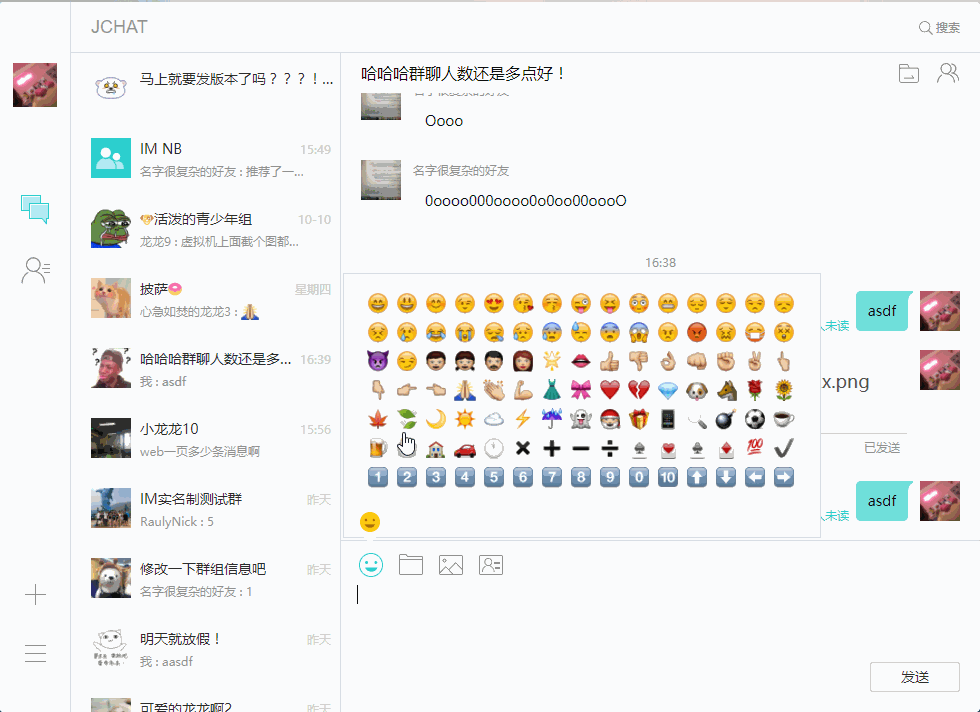
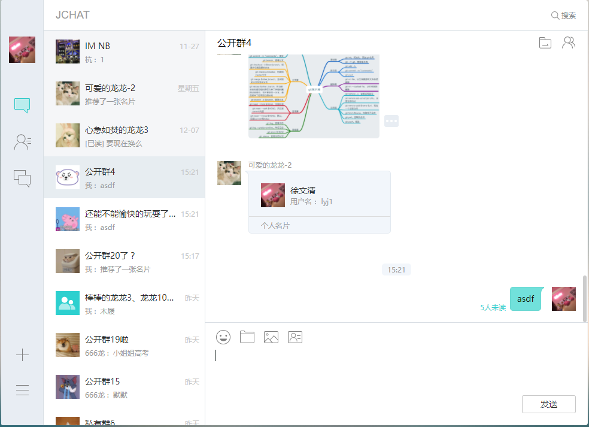

# JChat-web


		
### 简介

JChat 是基于 JMessage SDK 带有完整 UI 界面的即时通讯应用。 演示了完整的即时通讯功能，包括：

* 单聊、群聊、会话列表、通讯录、聊天室；
* 支持发送文本、图片、文件、表情、名片；
* 提供好友管理、群组管理、黑名单、群屏蔽、消息免打扰、通知栏、消息漫游、消息已读未读、会话置顶、群聊@XXX、多端在线等功能；

JChat 无需成为好友也可以聊天

* 通过搜索对方的用户名可直接发起会话

目前已覆盖 [Android](https://github.com/jpush/jchat-android) 、 [iOS](https://github.com/jpush/jchat-swift) 、[windows](https://github.com/jpush/jchat-windows)和 web 平台，开发者可参照 JChat 快速打造自己的产品，提高开发效率。



### 应用截图



### 在线体验地址

[JChat-web在线体验](https://jchat.im.jiguang.cn/#/login)

### 环境配置

前提：安装 node (node版本6.0以上、 npm版本3.0以上)，安装淘宝镜像cnpm([淘宝镜像安装方法](http://npm.taobao.org/))

web jchat本地安装和用法：
```
终端输入cd jchat-web-master
```
```
终端输入cnpm install
```
```
终端输入npm run dll
```
```
终端输入npm run dev
```
打开浏览器输入url地址：
localhost:3000

说明：
* 如果使用的不是本地localhost服务器，则要在task/webpack.dev.js中的publicPath改成自己的ip和端口，在浏览器输入ip和端口去访问项目

* 应用配置（前端生成签名和服务端生成签名，任选一种方式）：<br />
前端生成签名配置：<br />
在src/services/common/config.ts中<br />
1、填写appkey以及对应的masterSecret<br />
2、isFrontSignature改为true<br />
<br />
服务端生成签名配置：<br />
在src/services/common/config.ts中<br />
1、填写appkey，不填masterSecret，masterSecret放在服务端<br />
2、isFrontSignature改为false<br />
3、填写服务端接口url配置项signatureApiUrl<br />
4、在自己的服务端上开发出生成签名的post类型接口<br />
<br />
服务端生成签名的api详解：<br />
前端接口的调用相关的代码已经写好，开发者只需要配置好signatureApiUrl，并在服务端提供签名api接口即可<br />
服务端接收post请求，收到json数据，json数据结构如下:<br />
{<br />
  timestamp: new Date().getTime(),<br />
  appkey: authPayload.appkey,<br />
  randomStr: authPayload.randomStr<br />
}<br />
根据json数据及masterSecret生成签名，返回string类型格式的response给前端<br />
<br />
* 注意：
生产环境签名的生成需要在开发者服务端生成，不然存在 masterSecret 暴露的风险<br />

* 项目压缩打包并发布(前提：已全局安装gulp (终端输入cnpm install gulp -g))：

1. 在task/webpack.prod.js中的publicPath改成'./'
2. 终端输入gulp noqiniu-prod生成dist文件夹
3. 将dist目录下的所有文件上传到自己服务器上

### 备注说明

* 整个应用使用Angular2 + webpack + gulp的技术栈，使用了Angular2中的ngrx去管理应用状态
* 浏览器兼容性: IE11+ ， Chrome ， Firefox ， Safari

### JMessage 文档

* [JMessage web 开发指南](https://docs.jiguang.cn/jmessage/client/im_sdk_js_v2/)